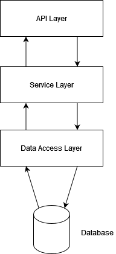

# Documentation

## Approach

To start the task, I first visualized the RESTApi and used it to make the following design decisions



### API Layer

The API layer, located in `EmailController.java`, handles incoming HTTP requests and manages the interaction with clients. It provides a set of endpoints for creating, retrieving, updating, and deleting emails. In addition, some endpoints were created to make test requests (`createTestEmails()`, `markAsSpamTest()`)

### Service Layer

The Service layer, located in `EmailService.java`, implements the business logic of the application. It coordinates the interaction between the API layer and the Data Access layer. The service layer is responsible for tasks such as email creation, updating, and the execution of scheduled tasks.

### Data Access Layer

The Data Access layer, located in `EmailRepository.java` provides an abstraction for data storage and retrieval. It uses Spring Data JPA to interact with the PostgreSQL database. The repositories define methods for querying and manipulating email data.

## Technology Decisions

Even though I had no previous experience with Spring Boot, I saw it as a challenge and also as motivation to work my way through it and complete this test.

The technology stack chosen for this project is as follows:

- **Spring Boot:** Used for creating the RESTful API and managing the application's lifecycle.
- **Spring Data JPA:** Provides easy integration with the database and simplifies data access.
- **PostgreSQL:** Selected as the relational database for storing email information.

## Testing

To test my code i ran multiple HTTP-Request as follows

```jsx
###
// create new mail
POST http://localhost:8080/emails/new

###
// run testmails
POST http://localhost:8080/emails/testmails

###
// test mark as spam
PUT http://localhost:8080/emails/markasspamtest

###
// send draft mails
PUT http://localhost:8080/emails/send1

###
PUT http://localhost:8080/emails/send2

###
PUT http://localhost:8080/emails/send3

###
PUT http://localhost:8080/emails/send4

###
// get all mails with state SENT
GET http://localhost:8080/emails/state/sent

###
// get all mails with receiver sven@gbtec.com
GET http://localhost:8080/emails/to/sven@gbtec.com

###
// get all mails with sender carl@gbtec.com
GET http://localhost:8080/emails/emails/from/carl@gbtec.com
```
## How to run the project
I set up a database via Postgres at localhost:5432/emailserver.
You can create your own database and then change the application properties at application.properties.\
The application is supposed to clear the database with each start. You wouldn't do that in a real scenario.